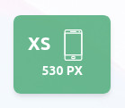

# **Vue Tailwind Screens Helper** <!-- omit in toc -->

[](https://www.npmjs.com/package/vue-tailwind-screens-helper)
[](https://github.com/ewilan-riviere/vue-tailwind-screens-helper/blob/master/LICENSE)

[](https://nodejs.org/en/)
[](https://vuejs.org/)
[](https://tailwindcss.com)

Display an helper at th left bottom corner in **development mode**, this helper display current breakpoint (xs, sm, md, lg or xl) with icon and exact window width in pixels.

**You can click on it to hide it**



- [**I. Download package**](#i-download-package)
- [**II. Setup**](#ii-setup)
  - [*II. a. With Vue-CLI*](#ii-a-with-vue-cli)
  - [*II. b. With Nuxt.js*](#ii-b-with-nuxtjs)
- [**III. Usage**](#iii-usage)
  - [*III. a. With Vue-CLI*](#iii-a-with-vue-cli)
  - [*III. b. With Nuxt.js*](#iii-b-with-nuxtjs)
- [**IV. API**](#iv-api)
- [**V. Tailwind breakpoints**](#v-tailwind-breakpoints)
- [**License**](#license)

## **I. Download package**

Install it with Yarn or NPM

```bash
yarn add -D vue-tailwind-screens-helper
```

**OR**

```bash
npm i vue-tailwind-screens-helper --save-dev
```

---

## **II. Setup**

### *II. a. With Vue-CLI*

Import it, ES6 way, in `main.js` / `app.js` file

```js
import TailwindScreensHelper from 'vue-tailwind-screens-helper'

Vue.use(TailwindScreensHelper)
```

### *II. b. With Nuxt.js*

Create a `plugins`: `plugins/vue-tailwind-screens.js`

```js
import Vue from 'vue'
import TailwindScreensHelper from 'vue-tailwind-screens-helper'

Vue.use(TailwindScreensHelper)
```

Import plugin into `nuxt.config.js`

```js
plugins: [
  // ...
  { src: '~/plugins/vue-tailwind-screens', mode: 'client' },
],
```

---

## **III. Usage**

### *III. a. With Vue-CLI*

Use it in a `.vue` file, like `App.vue`

```vue
<template>
  <div>
    <tailwind-screens />
  </div>
</template>
```

### *III. b. With Nuxt.js*

Use it in a `vue` file, like `layouts/default.vue`, don't forget to add `client-only` to setup it properly.

```vue
<template>
  <client-only>
      <tailwind-screens />
    </client-only>
</template>
```

---

## **IV. API**

*In future version, to use it without Tailwind CSS*

<!-- | Props        | Type    | Default | Describe                                                                   |
|--------------|---------|---------|----------------------------------------------------------------------------|
| ext          | String  | ''      | Extension of file, display it on header and get correct color if available |
| path         | String  | ''      | Path of the file, useful if it's guide for a framework                     |
| hasMargin    | Boolean | true    | To get margin top and bottom                               |
| notReachable | Boolean | false   | To apply a layer to prevent user to get code                               | -->

---

## **V. Tailwind breakpoints**

You can change Tailwind CSS breakpoints into `tailwind.config.js`, helper will adapt it-self when breakpoints change.

```js
module.exports = {
  theme: {
    // ...
    extend: {
      // ...
      screens: {
        xl: '1600px',
        lg: '1000px',
        md: '770px',
        sm: '400px',
      },
    },
  },
}
```

---

## **License**

**MIT** &copy; [**@ewilan-riviere**](https://github.com/ewilan-riviere)
